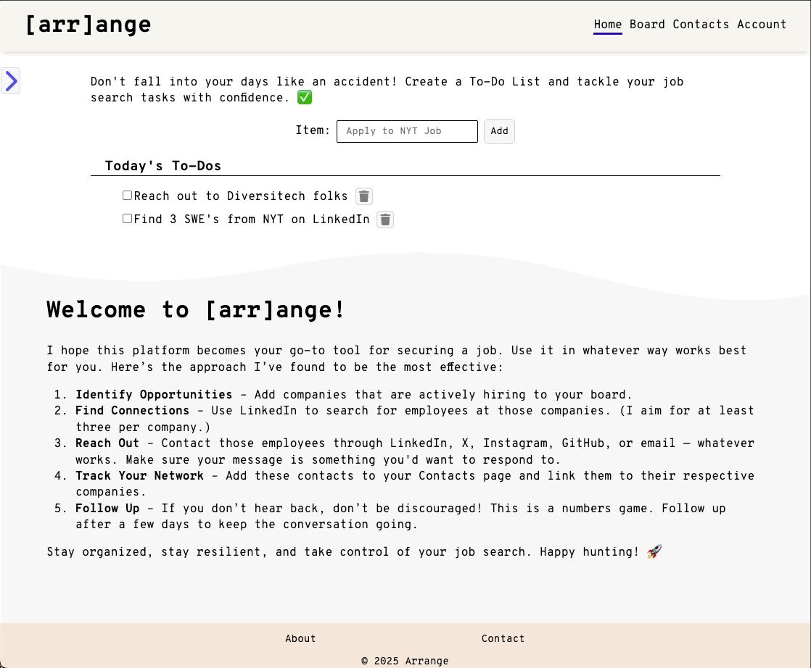

# Hitlist - [arr]ange

## Keep all the companies, contacts and leads on your hitlist organized with [arr]ange!

Your all-in-one platform to track job applications, manage documents, and stay on top of your career goals.

It is tailored to those looking for a job in tech, hence the pun in the name "[arr]ange"

The backend is handled by appwrite.

Error handling is implemented for PUT, POST and DELETE requests.

### Languages used:

- React.JS
- CSS (I love styling)
- I challenged myself to code every component myself for this project, that means no component libraries! If you see it on the app, I coded it!

# How To Run

1. Clone Repository
2. CD into root folder
3. Run: npm install
4. This is the step where you would run npm run dev and start the application (which you still can!), but you do not have access to the enviroment variables needed to run appwrite locally. So while you can still run it, none of the create, read, update, or delete capabilities will work while running the application locally.
